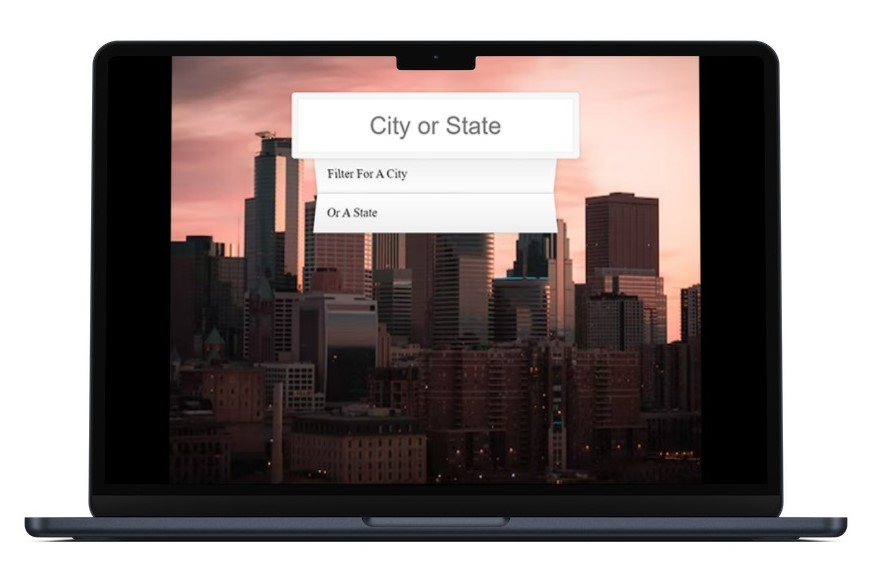

# City or State Search

This is a modification to the Ajax Type Ahead project in the [JavaScript 30 course by Wes Bos](https://javascript30.com/).

## Project Details

### View My Project: [https://ll-zerr.github.io/city-state-search/](https://ll-zerr.github.io/city-state-search/)

## Features

- Use fetch API in the browser to retrieve city data.
- Create a subset of data that match the search input.
- Highlight the search input within each city displayed.

## Technologies Used

- HTML5
- CSS3
- JavaScript

## Acknowledgements

Project Idea: Wes Bos, [JavaScript 30](https://javascript30.com/)

Original HTML, CSS & JavaScript by: Wes Bos, [JavaScript 30](https://javascript30.com/)

Background Image: [Kevin Nalty](https://unsplash.com/@nalty_photography) on [Unsplash](https://unsplash.com/photos/yLUM5exvsMA)